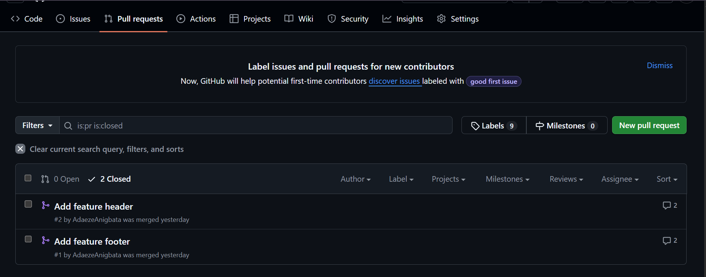

# -Frontend-version-control-task-Adaeze-Anigbata

## Branch Names & Purpose

- **main**: The production-ready code containing the final merged website.
- **feature-header**: The feature branch used to build the "Portfolio Website" heading, navigation bar and toggle button.
- **feature-footer-complete**: The feature branch used to build the copyright and social links section (renamed from feature-footer).

## Screenshots

### Merged Pull Requests

## Git Commands Used Most Frequently

- `git checkout -b <name>`: To create and switch to new branches.
- `git add .`: To stage changes.
- `git commit -m "message"`: To save changes to history.
- `git push`: To upload code to GitHub.
- `git merge`: To combine feature branches into main.
- `git revert HEAD`: To undo the "debug mode" mistake.
- `git fetch --all --prune`: To sync branch name changes from the remote.

## Lessons Learned

- **Merge Conflicts:** I learnt that conflicts happen when two branches touch the same lines of code, and I successfully resolved one by manually selecting the correct code blocks.
- **Reverting Mistakes:** I learnt that `git revert` is the safe way to undo errors because it creates a new commit instead of deleting history.
- **Branch Management:** I learnt how to rename a branch on GitHub and update my local computer to match it.
